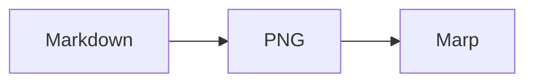

# misereru slide writing

`misereru` の `slides.md` を生成・再構成・推敲するときの内容設計ルールです。

このSkillは、スライドを単に短い文章へ変換するためのものではありません。資料の用途、根拠、ページごとの役割、日本語としての自然さ、画面上の可読性、情報構造に合った視覚表現を同時に扱います。

## 適用範囲

次の場合に使います。

- 新しい `slides.md` を作る
- 調査結果、仕様、文書、メモをスライド化する
- 既存スライドの構成や文章を直す
- 情報過多、冗長、AI的な空疎表現、根拠不足を点検する
- 文章・箇条書き・表・図の表現形式を見直す
- ページ追加・削除・並べ替えを伴う編集を行う

ビルド、theme、publish設定そのものを変更するSkillではありません。必要な場合も、内容編集と設定変更を混同しません。

## 最優先ルール

1. **正確さを密度より優先する。** 留保、条件、反証可能性、出典を削って短くしてはならない。長い場合はページを分ける。
2. **1 slide 1 primary message を基本とする。** ただし、そのメッセージを成立させるために必要な根拠・条件・比較は同じslideに置いてよい。
3. **資料の用途に合わせて密度を変える。** ライブ発表用の規則を、調査・共有用資料へ機械的に適用しない。
4. **見出しはページの役割を伝える。** 空のラベルではなく、対象、問い、観察、結論のいずれかが分かる見出しを優先する。
5. **事実と解釈を区別する。** 出典が必要な主張、資料から導ける解釈、提案・仮説を混同しない。
6. **既存の合意事項を勝手に格下げ・削除しない。** 意味が変わる編集は、短文化より内容保持を優先する。
7. **図にできる情報構造を箇条書きへ退化させない。** 関係、順序、状態遷移、階層、相互作用、数値推移が主題なら、文章を書く前に図・表・チャートを検討する。

## 1. 先に資料モードを決める

依頼や既存資料から判断できる場合は質問せずに決めます。不明点が残っても作業可能なら、安全な仮定を置いて進めます。

### Presented mode

登壇者が説明するライブ発表、デモ、口頭説明が主役の資料です。

- 画面上の文章は短くする
- headlineを先に決める
- 本文はheadlineにない情報だけを足す
- 同じ内容を話す前提なら、スライドへ全文を書かない
- 一目で主要メッセージを把握できることを重視する

### Reference mode

調査資料、共有資料、非同期閲覧、後から読み返す資料です。misereruではこのモードも主要用途として扱います。

- スライド単体でも意味が通る情報量を許容する
- 必要な根拠、条件、出典、比較軸を残す
- 文章を無理にキャッチコピー化しない
- 長い段落をそのまま押し込まず、論点分割・表・図・複数slide化で解決する
- 「3秒で読める」ことより、短時間で構造を把握でき、必要なら読み込めることを重視する

### Mixed mode

発表にも配布にも使う場合です。

- headlineと主要メッセージはPresented modeに近づける
- 根拠や条件はReference mode相当に保持する
- 1ページへ詰め込むより、補足slideやリンクへ分離する

## 2. 構成を先に作る

文章を書く前に、資料全体の役割とslide sequenceを確認します。

基本形は次です。

```text
目的 / 問い
  ↓
前提・背景
  ↓
主要な論点 / 調査結果 / 比較
  ↓
結論・現時点の整理
  ↓
必要なら未決事項 / 次の判断材料
```

これは固定テンプレートではありません。時系列、比較、手順、仕様整理など、内容に適した構造がある場合はそちらを優先します。

各slideについて「このslideがなくなると資料の理解に何が欠けるか」を説明できない場合、削除・統合候補です。

### ストーリー化を強制しない

既存のpresentation skillで有効なstory spineや「立場を取る」手法は、説得・提案型資料では使えます。一方、調査報告、仕様、比較、記録では、対立やドラマを人工的に作りません。

- 説得資料: 問題 → 根拠 → 提案 → 帰結の流れを使ってよい
- 調査資料: 問い → 証拠 → 比較 → 現時点の整理を優先する
- 仕様資料: 目的 → 制約 → 要件 → 判断・未決事項を優先する

## 3. 見出しを書く

見出しはページ内容の検索・走査にも使えるようにします。

良い見出しは次のいずれかです。

- **結論 / 観察:** `GitHub Pages公開は明示的な有効化が必要`
- **問い:** `なぜ既定でPagesを公開しないのか`
- **対象 + 観点:** `候補3方式の更新コスト比較`
- **手順 / 状態:** `初回公開時に必要な設定`

次のような空の見出しは、内容上の理由がない限り避けます。

- `概要`
- `ポイント`
- `詳細`
- `データ`
- `考察`

セクション見出しでは短いラベルを許容します。

見出しを強い断定へ変えるために、元資料の不確実性を消してはいけません。

## 4. 本文を書く

### 箇条書き

箇条書きは、並列関係のある情報に使います。

- 1項目1論点を基本にする
- 文章を短くする目的だけで、すべてを箇条書きへ変換しない
- 並列でない因果関係や論証は、短い本文または図・表を使う
- 項目数が増えたら分類またはslide分割を検討する

### 本文

Reference modeでは短い段落を使ってかまいません。

- 一段落一トピックを基本にする
- 冒頭で何を説明する段落か分かるようにする
- 同じ結論を言い換えて繰り返さない
- 前置きや予告だけの文章を置かない

### 表

複数候補を同じ評価軸で比べる場合は表を優先します。

- 行・列の軸を揃える
- セル内に別の比較軸を混ぜない
- 表が横長になりすぎる場合は、軸を減らすかslideを分ける
- 評価語だけでなく、判断根拠となる具体情報を置く

### コード・設定

- コード、設定、コマンドはコードブロックまたはinline codeで示す
- 実行に不要な長いコードを載せない
- 差分を示す場合は、何が変わるかを本文または見出しで明示する

### 図・視覚化

図は装飾ではなく、情報構造を直接表現するために使います。スライドを文章で埋めてから図を追加するのではなく、内容を整理する時点で表現形式を選びます。

次の対応を基本にします。

| 情報構造 | 第一候補 |
| --- | --- |
| 手順、処理、因果、分岐 | Flowchart |
| 複数主体の呼び出し・応答 | Sequence diagram |
| 状態と遷移 | State diagram |
| コンポーネント、依存、階層 | Flowchart / architecture diagram |
| エンティティ間関係 | ER diagram / Class diagram |
| 時系列の数値、量の比較 | XY chart / 適切なグラフ |
| 同じ軸で候補を比較 | 表 |
| 構造より留保・論証が主 | 本文 |

特に、次に該当する場合は箇条書きを第一候補にしません。

- 3つ以上の要素が矢印や依存関係で結ばれる
- 3段階以上の順序が理解の中心になる
- 同じ主体間で複数回のやり取りがある
- 状態が条件によって移る
- 数値系列の差や変化量を見ることが目的になる

逆に、図にすると条件や留保が消える場合、単なる飾りになる場合、関係が実際には存在しない場合は図解を強制しません。

misereruの正本では、Mermaidを通常のfenced code blockとして書けます。

````markdown

````

現行buildはMermaidブロックをPNGへ変換してからMarpへ渡します。sourceへ生成済みPNGやrenderer固有HTMLを貼り込む必要はありません。

移植性を優先する場合は、Flowchart / Sequence / State / Class / ER / XY chartを優先します。Gantt、Pie、MindmapなどMermaid CLIで扱える追加形式は、内容上必要な場合に使ってかまいませんが、renderer変更時には互換性を再確認します。

## 5. 日本語の技術文書として整える

### 論証と厳密さ

- 根拠のない推量を事実として書かない
- 複数要因を単一原因へ還元しない
- 相関と因果を混同しない
- 異なる概念を便宜上まとめた場合は、その範囲を明示する
- `必ず`、`完全に`、`唯一` などの絶対表現は、根拠がある場合だけ使う
- 不確実性が必要なら `現時点では`、`確認できた範囲では` など適切な留保を残す

### 主体と用語

- 行為者が重要な場合は、誰が何をするのかを明示する
- `AI`、`ツール`、`システム` など広すぎる主語を、必要に応じて具体化する
- 同じ概念の呼び方を途中で変えない
- プロジェクトで既に使われている用語を優先する

### AI的な空疎表現を避ける

中身を増やさない次のような表現は原則削除し、具体的内容へ置き換えます。

- `重要なのは〜です`
- `ここで注目したいのは〜です`
- `〜を深掘りします`
- `包括的に見ていきます`
- `核心的なポイントです`
- `〜と言えるでしょう`
- `単なる〜ではありません`

これらの語自体を機械的に禁止するのではなく、文章上の機能がない場合に削ります。

### 日本語と英数字

和文中の英数字前後へ半角スペースを必須にはしません。既存資料の表記と、日本語としての読みやすさを優先して統一します。

## 6. 根拠とリンクを扱う

外部情報に基づく資料では、後から検証可能な状態を保ちます。

- 数値、仕様、制度、日時、第三者評価など、検証が必要な主張には出典を残す
- 可能なら一次情報を優先する
- Markdown linkを使い、URL文字列だけを大量に並べない
- ひとつの出典が何を支えているか分かる位置に置く
- 出典に書かれていない解釈を、出典の主張として扱わない
- 調査中の未確認事項は未確認と分かるようにする

## 7. misereru固有のsource規則を守る

`slides.md` はmisereruの正本です。rendererへ直接合わせるために正本を壊してはいけません。

- slide区切りは `---`
- 既存のmetadata comment `<!-- {"key":"..."} -->` を保持する
- 既存slideの意味を保った編集ではstable `key` を変更しない
- 新規slideには、その内容を表す安定した `key` を付ける
- 目次へ載せるセクション見出しには既存仕様に従って `type: "section"` を使う
- `marp: true`、theme指定などrenderer固有front matterを正本へ追加しない
- 図はMermaid等のsource表現を正本へ置き、生成済みPNGを正本化しない
- themeやbuild処理で解決すべき見た目の問題を、本文へHTML/CSSを埋め込んで迂回しない
- publish/output設定を内容編集のついでに勝手に変更しない

## 8. 情報過多を処理する順序

slideが重い場合、文字サイズを下げる前に次の順で処理します。

1. 重複表現を削る
2. 本筋でない説明を別slideまたはリンクへ分ける
3. 関係・順序・状態・数値が主なら図・チャートへ変換する
4. 並列情報を表・箇条書きへ構造化する
5. 一つのslideに複数のprimary messageがあれば分割する
6. それでも必要な情報量なら、Reference modeとして密度を許容する

必要な根拠を削って見た目だけ軽くするのは不可です。

## 9. 自己レビュー

編集後、少なくとも次を確認します。

### Slide単位

- [ ] primary messageが1つに定まっている
- [ ] 見出しだけでページの役割が分かる
- [ ] 本文が見出しの単純な言い換えになっていない
- [ ] 不要な予告・総括・AI的表現がない
- [ ] 必要な条件・留保・出典を削っていない
- [ ] 関係・順序・状態・数値を、箇条書きだけで代替していない
- [ ] 図を使う場合、図が主張していない関係を作っていない
- [ ] 情報量が多い場合、分割可能性を検討した

### 資料全体

- [ ] 冒頭から結論まで構造が追える
- [ ] 同じ主張を複数slideで無意味に反復していない
- [ ] 用語と比較軸が一貫している
- [ ] 確定事項、未確認事項、提案を混同していない
- [ ] 各slideが資料全体で役割を持っている
- [ ] 本文・箇条書き・表・図が内容に応じて使い分けられている
- [ ] 本文・箇条書き中心のslideが連続する場合、図解可能性を再評価した
- [ ] metadata keyとsection指定を壊していない

### Presented mode追加確認

- [ ] 一目で主要メッセージを把握できる
- [ ] 登壇者が話す内容を全文転載していない
- [ ] 同じレイアウト・同じ文章量が単調に連続していない

### Reference mode追加確認

- [ ] スライド単体でも必要な文脈を追える
- [ ] 根拠と結論の対応が追える
- [ ] 後から読み返したときに、何が確定し何が未決か分かる

## References

このSkillは以下の既存Skill・規範を参照し、misereruの用途に合わせて独自に再構成しています。

- mblode/agent-skills — `presentation-creator`
  - https://github.com/mblode/agent-skills/tree/main/skills/presentation-creator
  - story / outline / slide copy / density / QAの考え方を主に参照
- robonuggets/marp-slides
  - https://github.com/robonuggets/marp-slides
  - Marpでのone idea per slide、overflow確認、visual variationの考え方を参照
- hikimay/japanese-tech-writing
  - https://github.com/hikimay/japanese-tech-writing
  - 論証の厳密さ、読者負荷、冗長性、LLM的表現の抑制を参照
- Mermaid CLI
  - https://github.com/mermaid-js/mermaid-cli
  - Markdown中のMermaidからPNGを生成する現行build経路を参照
- Marp Core Mermaid documentation
  - https://github.com/marp-team/marp-core/blob/main/docs/markdown.md
  - Mermaid native supportへ移行する場合の互換範囲を参照
- k16shikano「日本語技術文書の文章規範」
  - https://gist.github.com/k16shikano/fd287c3133457c4fd8f5601d34aa817d
- W3C 日本語組版処理の要件（JLREQ）
  - https://www.w3.org/International/jlreq/?lang=ja

参照元の規則はそのまま転載せず、misereruの正本source、用途別密度、日本語資料、既存metadataとの整合を優先しています。