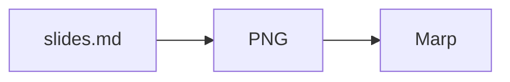

# misereru

Markdownを正本として、GitHub Actions上でスライドHTMLを生成するためのテンプレートです。通常運用はスマートフォン上のChatGPT / GitHubだけでも完結でき、ローカルPCやNode.js CLIを必須にしません。

> **名称 `misereru` は仮決定です。**
> 開発・調査資料は [`develop` branch](https://github.com/myokoym/misereru/tree/develop) 側で管理します。

## 動作サンプル

misereruで生成し、GitHub Pagesへ公開したスライドを実際に確認できます。

- [公開サンプルを見る](https://myokoym.github.io/misereru/)

## 使い方

このrepositoryをGitHub Template Repositoryとして使い、原則 **1資料 = 1 repository** で管理します。

```text
misereru (Template Repository)
  ↓ Use this template
presentation repository
  ↓
slides.md を編集
  ↓ commit / push
GitHub Actions
  ↓
Mermaid block → PNG（存在する場合）
  ↓
Marp
  ├─ HTML             常時生成
  ├─ PDF              設定時のみ
  └─ GitHub Pages     初版成立後に公開
```

通常編集するのは [`slides.md`](slides.md) です。必要に応じて [`presentation-script.md`](presentation-script.md) と [`article.md`](article.md) を併用します。出力や公開方法を変える場合だけ [`misereru.config.json`](misereru.config.json) を編集します。

## `slides.md` はサンプル兼テンプレート

`slides.md` 自体に、資料作成で使う代表的なページを一通り入れています。

- 表紙
- セクション見出し
- 通常本文
- 長めの本文
- 箇条書き
- 番号付き手順
- 表
- Mermaid図
- 引用
- コードブロック
- 外部リンク
- 強調表現
- 複数要素を含むページ
- まとめ

`type: "section"` のページから目次を自動生成します。新しい資料では、`slides.md` の文章を書き換え、不要なページを削除して使います。

### 図はMermaidを正本にできる

手順、依存関係、状態遷移、主体間のやり取りなど、文章より図の方が構造を伝えやすい内容は、`slides.md` にMermaidコードブロックとして書けます。

````markdown

````

現行production buildでは、[`scripts/render-mermaid.mjs`](scripts/render-mermaid.mjs) がMermaidをPNGへ変換し、PNGをdata URIとしてMarp入力へ埋め込んでからHTML / PDFを生成します。生成済みPNGをrepositoryで管理する必要はなく、GitHub Pages側でも別画像ファイルへの参照を必要としません。

図を使うかどうかは枚数比率では決めません。処理フロー、相互作用、状態、階層、関係、数値推移など、図に向く情報構造がある場合に文章・箇条書きより優先して検討します。

図の共通themeは [`mermaid.config.json`](mermaid.config.json) で管理します。現行既定はノード文字28pxで、**図を収めるための文字縮小は行いません**。重い図は、文言削減 → 構造簡略化 → 図またはslide分割の順で処理し、実renderで可読性を確認します。

## 発表原稿は任意

[`presentation-script.md`](presentation-script.md) は、`slides.md` とstable `key`で対応する発表原稿のサンプルです。

**原稿を使わない資料では、このファイルは不要です。** `slides.md` だけで資料を作る運用を標準で許容します。また、必要なslideだけ原稿を書くpartial scriptも正常な状態として扱います。

通常buildでは、`presentation-script.md` がなければ検査をスキップし、存在する場合だけstable key参照・重複・Narration欠落等を検査します。一部のslideに原稿がないことはerrorにしません。

全slide分の原稿が揃っていることを明示的に確認したい場合だけ、次を使えます。

```bash
npm run build:script-complete
```

発表原稿を持つ主目的は、口頭説明を別sourceとして管理できることと、**slides → script / script → slides の両方向から構成・内容を確認できること**です。

### 発表原稿のGitHub Pages公開

発表原稿をGitHub Pagesから直接閲覧したい資料だけ、`misereru.config.json` で明示的に有効化できます。

```json
{
  "publish": {
    "githubPages": {
      "enabled": true,
      "presentationScript": {
        "enabled": true
      }
    }
  }
}
```

有効時は、正本の `presentation-script.md` を検証した後、閲覧用の `presentation-script.html` を生成します。raw Markdown自体はPagesへ公開しません。

## 記事形式も任意

[`article.md`](article.md) は、スライドや発表原稿を見なくても単体で読めるブログ記事・解説記事形式の正本です。

発表原稿とは役割が異なります。`presentation-script.md` はスライドを見ながら話す前提ですが、`article.md` は文章だけで前提・根拠・留保・結論まで理解できる状態を目指します。

そのため記事では、次を基本とします。

- スライドとの1対1対応は要求しない
- スライド順をそのまま見出し順へ変換しない
- 記事として自然な章立て・接続へ再構成する
- 「このスライド」「次の表」のような画面依存表現を使わない
- H1は記事タイトル1つだけ
- raw HTMLは使わず、Markdownだけで記述する
- 主要な事実・数値・条件・留保はslides / research等と矛盾させない

### 初回Pages公開のタイミング

Pagesは「全形式完成」を待ちません。次のいずれかが成立した時点を初回公開の目安とします。

- `slides.md` が、テンプレート残骸ではなく一つの資料として最初から最後まで閲覧できる
- `article.md` が、スライドや口頭補足なしで一つの記事として最初から最後まで読める

「初版成立」は最終版を意味しません。以後の修正・追加を前提として構いません。重要なのは、公開対象そのものに致命的な欠落やテンプレート残骸がなく、buildが通り、既知の重大な事実誤認が残っていないことです。

一方、他形式が未完成であることは公開阻害条件にしません。たとえば記事が初版成立していれば、`slides.md` がまだサンプル状態でも、記事をPagesで確認できることを優先します。サンプルの同時公開は後で解消すべき表示上の問題ですが、完成済み成果物を閲覧不能にするより優先度を下げます。

### 記事のGitHub Pages公開

記事を公開したい資料だけ、次を明示的に有効化します。

```json
{
  "publish": {
    "githubPages": {
      "enabled": true,
      "article": {
        "enabled": true
      }
    }
  }
}
```

有効時は `article.md` を読み物向けに整形した `article.html` をPagesルートへ生成します。

```text
https://<owner>.github.io/<repository>/article.html
```

記事公開はスライドや発表原稿の公開設定とは独立しています。`article.enabled: true` なのに `article.md` が存在しない場合、GitHub Pages自体が無効な場合、H1が1つでない場合、raw HTMLまたは危険なURL schemeを含む場合はbuild errorにします。

## AI向けsourceも任意

調査や記事から、ChatGPT等へそのままアップロードして再利用するMarkdown参照資料を作れます。

AI向けsourceはroot直下ではなく `ai-sources/` にまとめます。固定名の `ai-reference.md` は使わず、**ダウンロード後にrepository文脈を失っても主題が分かるファイル名**にします。

例:

```text
ai-sources/level-design.md
ai-sources/urban-planning.md
ai-sources/openjev.md
```

原則は **1つのまとまった主題 = 1ファイル** です。flow / pacing / wayfindingのような小概念ごとに機械的に細分化せず、1主題として一体なら多少長くても1ファイルを維持します。複数ファイルにするのは、別主題として単独利用する意味がある場合だけです。

AI向けsourceは `.agents/skills/misereru-ai-source-writing/SKILL.md` の規則で作成・レビューします。これはAgent Skillそのものではなく、AIへ主題知識・判断基準を渡す成果物です。

## AIでの資料編集

テンプレートには、repository運用を固定する [`AGENTS.md`](AGENTS.md) と、misereru用のAgent Skillを含めます。

`AGENTS.md` は、既存repositoryを確認せず別PPTXや別資料を生成しないこと、正本と生成物を区別すること、更新時の同期順序、build / publish確認などの**運用ガードレール**を定義します。

Agent Skillは各成果物の内容設計を担当します。

- [`misereru-slide-writing`](.agents/skills/misereru-slide-writing/SKILL.md): `slides.md` の構成・文章・根拠・密度・図解判断を扱う
- [`misereru-presentation-script`](.agents/skills/misereru-presentation-script/SKILL.md): 任意の発表原稿作成とslideとの相互レビューを扱う
- [`misereru-article-writing`](.agents/skills/misereru-article-writing/SKILL.md): 単体で読める記事の構成・文章と、slides / researchとの整合性を扱う
- [`misereru-ai-source-writing`](.agents/skills/misereru-ai-source-writing/SKILL.md): ChatGPT等へ直接アップロードする主題名Markdownの構成、分割判断、research等との整合性を扱う

配置はCodexのrepository-scoped Skill discoveryに合わせて `.agents/skills/` とします。`AGENTS.md` はSkill発見のためではなく、repository全体の運用・誤操作防止のために置きます。

## 既定の出力

- HTML: 有効。`dist/site/index.html` を生成
- PDF: 無効。必要な資料だけ有効化
- GitHub Pages: テンプレート作成直後は無効。**slides または article のどちらか一つでも初版が成立したら有効化**
- GitHub Pages上の発表原稿: 無効。明示時のみ `presentation-script.html` を生成・公開
- GitHub Pages上の記事: 無効。明示時のみ `article.html` を生成・公開
- Google Slides / PPTX: 初期production targetには含めない

Template Repositoryでは、空の企画・サンプル状態を即公開しないため `publish.githubPages.enabled` は既定OFFです。ただし、このOFFを「この資料は公開しないという意思決定」と解釈しません。`slides.md` または `article.md` のどちらか一つでも、単体で一通り読める／見られる初版になった時点でPagesをONにします。他形式が未完成でも待ちません。特に、完成した記事をブラウザで確認できないことを避けるため、未完成のサンプルslideが一時的に同時公開されることだけを理由にPages公開を遅らせません。

## Template files

新しい資料repositoryで必要な実行・編集支援ファイルは、テンプレート側にすべて含めます。

```text
AGENTS.md                                               # AI向けrepository運用・誤操作防止ルール
slides.md                                               # サンプル兼 Markdown source
presentation-script.md                                 # 任意の発表原稿サンプル
article.md                                             # 任意の単体完結記事サンプル
misereru.config.json                                    # output / publish 設定
mermaid.config.json                                     # Mermaid共通theme / 可読性既定値
.agents/skills/misereru-slide-writing/SKILL.md          # AI向けスライド内容・図解設計ルール
.agents/skills/misereru-presentation-script/SKILL.md    # AI向け発表原稿・相互レビュー規則
.agents/skills/misereru-article-writing/SKILL.md        # AI向け記事作成・整合性確認規則
.agents/skills/misereru-ai-source-writing/SKILL.md      # AIへアップロードする主題別Markdown作成規則
package.json                                            # build依存とcommand
marp.config.mjs                                         # Marp設定
themes/                                                 # 日本語向けMarp theme
scripts/build-project.mjs                               # 目次生成、原稿構造検査、build処理
scripts/render-mermaid.mjs                              # MermaidをPNGへ変換してMarp入力へ埋め込む
scripts/render-presentation-script.mjs                  # 発表原稿のPages向けHTML生成
scripts/render-article.mjs                              # 記事のPages向けHTML生成
.github/workflows/build.yml                             # GitHub Actions build / publish
```

`slides.md`、`presentation-script.md`、`article.md`、設定、theme、build処理を変更してpushすると、GitHub Actionsが設定済みoutputを生成します。`AGENTS.md`と`.agents/skills/`は編集支援用で、build時の実行依存にはしません。

## Repository branch model

このrepository自身は、配布物と開発資料をbranchで分けます。

- [`main`](https://github.com/myokoym/misereru/tree/main): Template Repositoryとして配布する自己完結セット
- [`develop`](https://github.com/myokoym/misereru/tree/develop): 開発・統合用。docs / research / prototype等を含む

Template Repositoryから通常作成した資料repositoryにはdefault branchである `main` の内容を使う想定です。

**この `main` / `develop` 2branch modelはmisereru本体の内部運用であり、派生repositoryへ自動継承しません。** 派生した資料・調査repositoryは、そのrepository自身のREADME / AGENTSに別規定がなければdefault branchを正本として使います。調査型repositoryでは、調査途中の記録・source・中間仮説を含む履歴をdefault branchへ蓄積して構いません。「未完成」「調査中」であることだけを理由に `develop` branchを作りません。

## 開発・設計資料

開発者向け資料は [`develop` branch](https://github.com/myokoym/misereru/tree/develop) を参照します。

- [運用モデル](https://github.com/myokoym/misereru/blob/develop/docs/product/operation-model.md)
- [要件](https://github.com/myokoym/misereru/blob/develop/docs/product/requirements.md)
- [スライドツール調査](https://github.com/myokoym/misereru/blob/develop/docs/research/slide-tools.md)
- [日本語組版調査](https://github.com/myokoym/misereru/blob/develop/docs/research/japanese-typesetting.md)
- [source / output architecture](https://github.com/myokoym/misereru/blob/develop/docs/research/source-output-architecture.md)
- [発表原稿と相互レビュー調査](https://github.com/myokoym/misereru/blob/develop/docs/research/presentation-script.md)
- [Marp prototype](https://github.com/myokoym/misereru/blob/develop/docs/research/marp-prototype.md)
- [命名調査](https://github.com/myokoym/misereru/blob/develop/docs/research/naming.md)

正本 `slides.md` はMarp固有front matterを持たせません。Mermaid図もsource記法のまま保持し、build時に一時的なPNGとMarp入力を生成します。初期production buildではMarpだけをrendererとして使用します。
