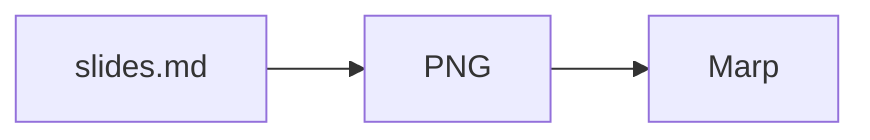

# misereru

Markdownを正本として、GitHub Actions上でスライドHTMLを生成するためのテンプレートです。通常運用はスマートフォン上のChatGPT / GitHubだけでも完結でき、ローカルPCやNode.js CLIを必須にしません。

> **名称 `misereru` は仮決定です。**
> 開発・調査資料は [`develop` branch](https://github.com/myokoym/misereru/tree/develop) 側で管理します。

## 使い方

このrepositoryをGitHub Template Repositoryとして使い、原則 **1資料 = 1 repository** で管理します。

```text
misereru (Template Repository)
  ↓ Use this template
presentation repository
  ↓
slides.md を編集
  ↓ commit / push
GitHub Actions
  ↓
Mermaid block → PNG（存在する場合）
  ↓
Marp
  ├─ HTML             常時生成
  ├─ PDF              設定時のみ
  └─ GitHub Pages     設定時のみ公開
```

通常編集するのは [`slides.md`](slides.md) です。出力や公開方法を変える場合だけ [`misereru.config.json`](misereru.config.json) を編集します。

## `slides.md` はサンプル兼テンプレート

`slides.md` 自体に、資料作成で使う代表的なページを一通り入れています。

- 表紙
- セクション見出し
- 通常本文
- 長めの本文
- 箇条書き
- 番号付き手順
- 表
- Mermaid図
- 引用
- コードブロック
- 外部リンク
- 強調表現
- 複数要素を含むページ
- まとめ

`type: "section"` のページから目次を自動生成します。新しい資料では、`slides.md` の文章を書き換え、不要なページを削除して使います。別の「最小テンプレート」と「サンプルデッキ」は持たず、この1ファイルを基準にします。

### 図はMermaidを正本にできる

手順、依存関係、状態遷移、主体間のやり取りなど、文章より図の方が構造を伝えやすい内容は、`slides.md` にMermaidコードブロックとして書けます。

````markdown

````

現行buildでは、[`scripts/render-mermaid.mjs`](scripts/render-mermaid.mjs) がMermaidをPNGへ変換し、PNGをdata URIとしてMarp入力へ埋め込んでからHTML / PDFを生成します。生成済みPNGをrepositoryで管理する必要はありません。

図を使うかどうかは枚数比率では決めません。処理フロー、相互作用、状態、階層、関係、数値推移など、図に向く情報構造がある場合に文章・箇条書きより優先して検討します。

図の共通themeは [`mermaid.config.json`](mermaid.config.json) で管理します。現行既定はノード文字28pxで、**図を収めるための文字縮小は行いません**。重い図は、文言削減 → 構造簡略化 → 図またはslide分割の順で処理し、実renderで可読性を確認します。

## 発表原稿は任意

[`presentation-script.md`](presentation-script.md) は、`slides.md` とstable `key`で対応する発表原稿のサンプルです。

**原稿を使わない資料では、このファイルは不要です。** `slides.md` だけで資料を作る運用を標準で許容します。また、必要なslideだけ原稿を書くpartial scriptも正常な状態として扱います。

通常の `npm run build:project` / GitHub Actionsでは次のように扱います。

- `presentation-script.md` がない: 検査をスキップ。warningも出さない
- 存在する: 書かれているentryだけ、stable key参照・重複・Narration欠落等を検査
- 一部のslideに原稿がない: 正常。coverage不足として失敗させない

全slide分の原稿が揃っていることを明示的に確認したい場合だけ、次を使えます。

```bash
npm run build:script-complete
```

このcomplete checkは通常資料の必須工程ではありません。

発表原稿を持つ主目的は、口頭説明を別sourceとして管理できることと、**slides → script / script → slides の両方向から構成・内容を確認できること**です。原稿側で説明しないと成立しない重要論点や、slide順と話す順番の矛盾が見つかった場合は、原稿だけでなくslide構成も修正対象へ戻します。

将来、音声合成・録画・発表動画・字幕生成等へ流用することはできますが、現時点の主要用途には置きません。timingやcue等を通常の発表原稿へ先回りして必須化しません。

## AIでの資料編集

`develop` branchには、repository / branch運用を固定する [`AGENTS.md`](AGENTS.md) と、misereru用のAgent Skillを含めます。

`AGENTS.md` は `main` と `develop` の役割を混同しないこと、既存repositoryを確認してから作業すること、未確定の調査・実装をproductionへ勝手に昇格させないことを定義します。

Agent Skillは各成果物の内容設計を担当します。

- [`misereru-slide-writing`](.agents/skills/misereru-slide-writing/SKILL.md): `slides.md` の構成・文章・根拠・密度・図解判断を扱う
- [`misereru-presentation-script`](.agents/skills/misereru-presentation-script/SKILL.md): 任意の発表原稿作成とslideとの相互レビューを扱う

`misereru-slide-writing` は次を扱います。

- Presented / Reference / Mixed の用途別に情報密度を調整する
- 1 slide 1 primary messageを基本に構成する
- 根拠、留保、出典を短文化のために削らない
- 関係、順序、状態、相互作用、数値推移は図・表・チャートを第一候補として検討する
- 日本語技術文書として論証、用語、冗長性、AI的な空疎表現を点検する
- stable `key`、`type: "section"`、renderer非依存の正本sourceというmisereru固有ルールを守る

`misereru-presentation-script` は、原稿を使う場合に次を扱います。

- stable `key`によるslideと原稿の対応
- slide本文の逐語読み上げではない自然な口頭説明
- slides → script / script → slides の意味的な相互チェック
- slides-only / partial script / complete script の区別

配置はCodexのrepository-scoped Skill discoveryに合わせて `.agents/skills/` とします。`AGENTS.md` はSkill発見用ではなく、repository / branch全体の運用・誤操作防止のために置きます。

## 既定の出力

- HTML: 有効。`dist/site/index.html` を生成
- PDF: 無効。必要な資料だけ有効化
- GitHub Pages: 無効。明示的に有効化した場合だけ公開
- Google Slides / PPTX: 初期production targetには含めない

GitHub Pagesを使う場合は、各資料repositoryで初回だけ Settings > Pages から GitHub Actions publishing を有効化する想定です。公開を自動化するためだけの高権限PATは標準要求しません。

## Template files

新しい資料repositoryで必要な実行・編集支援ファイルは、テンプレート側にすべて含めます。外部のmisereru repositoryを実行時に参照しません。

```text
AGENTS.md                                               # AI向けrepository / branch運用・誤操作防止ルール
slides.md                                               # サンプル兼 Markdown source
presentation-script.md                                 # 任意の発表原稿サンプル。不要なら削除可
misereru.config.json                                    # output / publish 設定
mermaid.config.json                                     # Mermaid共通theme / 可読性既定値
.agents/skills/misereru-slide-writing/SKILL.md          # AI向けスライド内容・図解設計ルール
.agents/skills/misereru-presentation-script/SKILL.md    # AI向け発表原稿・相互レビュー規則
package.json                                            # Marp / Mermaid依存とbuild command
marp.config.mjs                                         # Marp設定
themes/                                                 # 日本語向けMarp theme
scripts/build-project.mjs                               # 目次生成、原稿構造検査、build処理
scripts/render-mermaid.mjs                              # MermaidをPNGへ変換してMarp入力へ埋め込む
.github/workflows/build.yml                             # GitHub Actions build / publish
```

`slides.md`、`presentation-script.md`、設定、theme、build処理を変更してpushすると、GitHub Actionsが設定済みoutputを生成します。`.agents/skills/` は編集支援用で、build時の実行依存にはしません。

## Repository branch model

このrepository自身は、配布物と開発資料をbranchで分けます。

- [`main`](https://github.com/myokoym/misereru/tree/main): Template Repositoryとして配布する自己完結セット
- [`develop`](https://github.com/myokoym/misereru/tree/develop): 開発・統合用。docs / research / prototype等を含む

Template Repositoryから通常作成した資料repositoryにはdefault branchである `main` の内容を使う想定です。開発資料を利用者の資料repositoryへ持ち込まないため、`main` には配布に必要なものだけを置きます。

**この `main` / `develop` 2branch modelはmisereru本体専用です。** Templateから作成した資料・調査repositoryへ同じbranch構成を自動継承しません。派生repositoryは、そのrepository自身のREADME / AGENTSに別規定がなければdefault branchを正本として運用します。調査型repositoryでは、未完成の調査・中間仮説・source ledgerを含む全履歴をdefault branchへ蓄積して構いません。「調査中だから」という理由だけで `develop` branchを追加しません。

## 開発・設計資料

開発者向け資料は [`develop` branch](https://github.com/myokoym/misereru/tree/develop) を参照します。Template Repositoryから作成した別repositoryでもリンクが切れないよう、ここでは元repositoryへのリンクを使います。

- [運用モデル](https://github.com/myokoym/misereru/blob/develop/docs/product/operation-model.md)
- [要件](https://github.com/myokoym/misereru/blob/develop/docs/product/requirements.md)
- [スライドツール調査](https://github.com/myokoym/misereru/blob/develop/docs/research/slide-tools.md)
- [日本語組版調査](https://github.com/myokoym/misereru/blob/develop/docs/research/japanese-typesetting.md)
- [source / output architecture](https://github.com/myokoym/misereru/blob/develop/docs/research/source-output-architecture.md)
- [発表原稿と相互レビュー調査](https://github.com/myokoym/misereru/blob/develop/docs/research/presentation-script.md)
- [Marp prototype](https://github.com/myokoym/misereru/blob/develop/docs/research/marp-prototype.md)
- [命名調査](https://github.com/myokoym/misereru/blob/develop/docs/research/naming.md)

正本 `slides.md` はMarp固有front matterを持たせません。Mermaid図もsource記法のまま保持し、build時に一時的なPNGとMarp入力を生成します。初期production buildではMarpだけをrendererとして使用します。
